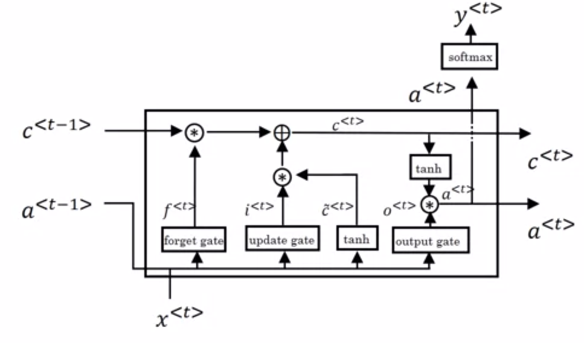
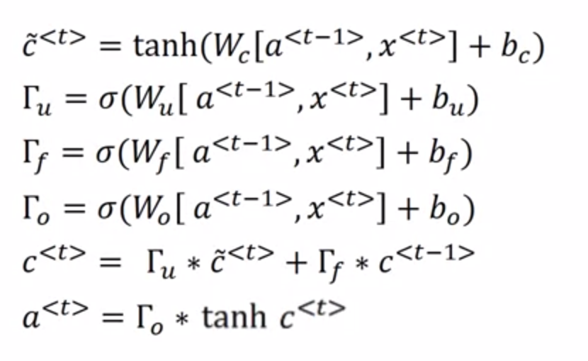

# LSTM-numpy
This work was created by ungraduated student - who first approach to Recurrent Neural Network. Therefore, it cannot be applied to any tasks to training or evaluating yet (I'm not sure if I can implement backpropagation for RNN lol).

My implemention of LSTM using numpy which easy to code and wokrking with matrix in a range of Algebra. I made this implemention to understanding how RNN, GRU or LSTM Network work and what is inside.

If you wanna see how RNN be apllied to a specify task, you could visit my coming up repo. I will use PyTorch for this (and Attention or Transform maybe). 

Thanks for your visiting!

# Architecture

# Mathematical Analysis

